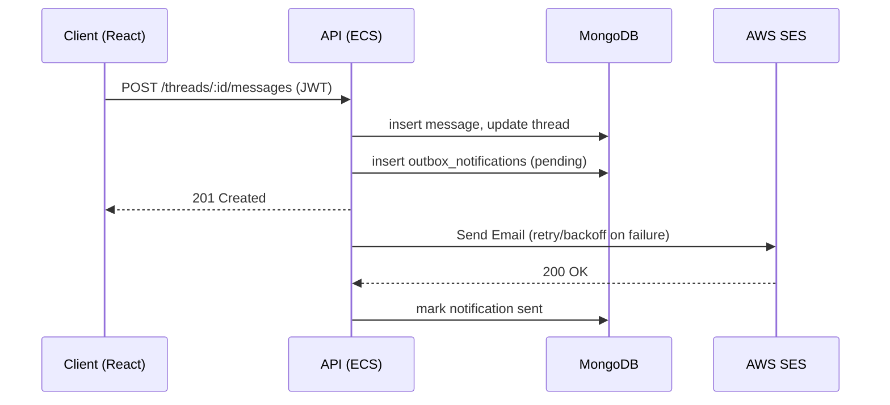
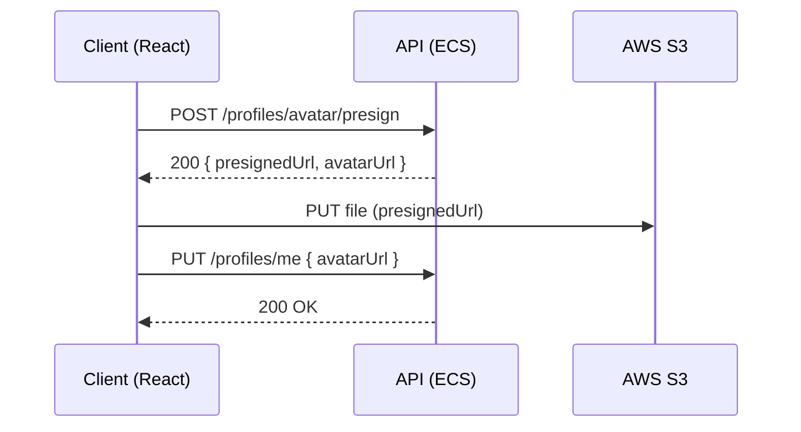

## Skill Exchange Platform — Architecture and Build/Deploy Workflow

This document describes the production-grade architecture, component responsibilities, data flow, and end-to-end workflows for building and deploying the Skill Exchange platform. It aligns with the implementation described: React frontend; Node.js backend; MongoDB; AWS ECS; AWS SES/S3; JWT auth; retries; error handling; CloudWatch metrics; and structured logging.

### Goals
- Deliver a reliable 0→1 full‑stack platform for local skill exchange
- Provide robust auth, messaging, and notifications
- Ensure observability, fault tolerance, and scalable delivery

---

## High-Level Architecture

- **Frontend (Web)**: React (SPA) served via CDN or behind an ALB → communicates with backend REST APIs via HTTPS.
- **Backend (API Service)**: Node.js/Express running in ECS (Fargate) behind an Application Load Balancer (ALB). Implements auth, user/profile, listings, messaging, and notifications.
- **Database**: MongoDB (Atlas or self-managed). Primary write/read cluster with TLS enforced. Uses Mongoose.
- **Object Storage**: AWS S3 for user-uploaded avatars/attachments. Pre‑signed URL flow for secure client uploads/downloads.
- **Email Notifications**: AWS SES for transactional email (sign-up, message alerts, system notifications).
- **Queue/Async Jobs (optional enhancement)**: SQS for decoupling notification dispatch and retries.
- **Secrets/Config**: AWS SSM Parameter Store or Secrets Manager; runtime env passed to ECS tasks.
- **Observability**: CloudWatch metrics, logs (JSON structured), dashboards, and alarms.

```
[React SPA] ──HTTPS──> [ALB] ──> [ECS Service: Node.js API]
                                    │
                                    ├── MongoDB (Atlas)
                                    ├── S3 (uploads via presigned URLs)
                                    ├── SES (transactional email)
                                    └── CloudWatch (logs/metrics/alarms)
```

---

## Services and Responsibilities

- **Auth Service**
  - JWT-based auth (HS256/RS256). Access token short‑lived; optional refresh token with rotation.
  - Password hashing (argon2 or bcrypt) and email verification via SES.
  - Middleware for protected routes; role-based guards for admin endpoints if needed.

- **User/Profile Service**
  - CRUD profiles, skills, available time slots, location radius, reputation score.
  - S3 pre‑signed URLs for avatar uploads; lifecycle policies to expire temporary objects.

- **Listing/Matching Service**
  - Create/manage skill offers/requests; search by skill/location.
  - Matching algorithm (tag/skill-based + optional distance filter).

- **Messaging Service**
  - Threaded conversations between matched users.
  - Store message metadata in MongoDB; file attachments via S3.

- **Notification Service**
  - Email notifications via SES for new messages, matches, and system events.
  - Retry with exponential backoff; idempotency keys to avoid duplicates.

---

## Data Model (MongoDB outline)

- `users`
  - `_id`, `email`, `passwordHash`, `emailVerified`, `roles[]`, `createdAt`, `updatedAt`

- `profiles`
  - `_id`, `userId`, `displayName`, `bio`, `skills[]`, `location`, `avatarUrl`, `reputation`

- `listings`
  - `_id`, `ownerUserId`, `type` (offer|request), `skills[]`, `description`, `status`, `location`, `createdAt`

- `messages`
  - `_id`, `threadId`, `senderUserId`, `recipientUserId`, `body`, `attachments[]`, `createdAt`, `readAt`

- `threads`
  - `_id`, `participantUserIds[]`, `lastMessageAt`, `listingId` (optional)

- `outbox_notifications`
  - `_id`, `type` (email), `to`, `subject`, `payload`, `dedupeKey`, `status` (pending|sent|failed), `attempts`, `nextAttemptAt`, `createdAt`

Indexes: email unique on `users`; compound indexes for `messages(threadId, createdAt)`; geo index for `profiles.location` and `listings.location` where applicable; TTL or cleanup job for stale `outbox_notifications`.

---

## API Surface (Representative)

- `POST /auth/register`, `POST /auth/login`, `POST /auth/refresh`, `POST /auth/logout`
- `GET /profiles/me`, `PUT /profiles/me`, `POST /profiles/avatar/presign`
- `POST /listings`, `GET /listings`, `GET /listings/:id`, `PUT /listings/:id`, `DELETE /listings/:id`
- `POST /threads`, `GET /threads`, `GET /threads/:id/messages`, `POST /threads/:id/messages`
- `POST /notifications/test` (admin only)

Response format: JSON; errors standardized via problem+json style with machine codes.

---

## Security Model

- **JWT**: Access token in Authorization header (Bearer). Short expiry (e.g., 15m). Refresh token via secure HTTP-only cookie or rotation endpoint with device binding.
- **Password Policy**: Argon2id with strong parameters; rate limit login and password reset.
- **Transport**: TLS everywhere via ALB; strict CORS policy and CSRF protection for refresh flows.
- **S3 Access**: Only via pre‑signed URLs; least-privilege IAM for backend task role.
- **Secrets**: Stored in SSM/Secrets Manager; never committed. Config injected at task run.
- **Validation**: Centralized request validation (e.g., zod/joi) and output filtering.

---

## Reliability Patterns

- **Retries**
  - SES email send: exponential backoff (e.g., 1s, 5s, 25s) with jitter; max attempts; circuit-breaker on sustained failures.
  - Outbound HTTP (if used): retry idempotent requests; set connect/read timeouts.

- **Idempotency**
  - `dedupeKey` in `outbox_notifications` to avoid duplicate sends.
  - Message creation endpoints may accept an `idempotencyKey` header to prevent duplicates on client retries.

- **Error Handling**
  - Central error middleware maps internal errors to sanitized HTTP responses.
  - Use typed errors with machine-readable codes; include `requestId` for correlation.

- **Structured Logging**
  - JSON logs: `timestamp`, `level`, `requestId`, `userId`, `route`, `latencyMs`, `err.code`, `err.message`.
  - One log line per request (summary), plus error logs when applicable.

---

## Observability

- **CloudWatch Logs**: One log group per environment/service. Retention policy configured.
- **Metrics**: Custom metrics published from the API:
  - `api.requests.count`, `api.requests.latency.p50/p95/p99`
  - `notifications.sent.count`, `notifications.failed.count`
  - `auth.login.success`, `auth.login.failed`
- **Dashboards**: Latency percentiles, error rates (4xx/5xx), notification failure rate, SES bounce/complaint rates.
- **Alarms**: On elevated 5xx, p95 latency spikes, or notification failures exceeding threshold.

---

## Messaging and Notification Flow

1. User A sends a message to User B in a thread.
2. API writes `message` to MongoDB and updates `threads.lastMessageAt`.
3. API enqueues an `outbox_notifications` entry with `dedupeKey` (`threadId#recipient#messageId`).
4. Notification worker (in same service cron or separate ECS service) pulls pending notifications:
   - Attempts SES send; records messageId, increments `attempts`, updates status.
   - On failure, schedules `nextAttemptAt` with exponential backoff and jitter.
5. On success, mark `sent`; on repeated failures beyond threshold, mark `failed` and alert.

---

## File Upload Flow (S3 Pre‑Signed URLs)

1. Client requests `POST /profiles/avatar/presign` with file metadata.
2. API validates file type/size and returns pre‑signed PUT URL and final `avatarUrl`.
3. Client uploads directly to S3 using the pre‑signed URL.
4. Client confirms success by updating profile with `avatarUrl`.

---

## Build and Deployment Workflow (AWS ECS)

### Environments
- `dev`, `staging`, `prod` with isolated resources, parameters, and SES/S3 configurations.

### CI/CD Pipeline (example)
- Trigger: Git push to `main` or tagged releases.
- Steps:
  1. Install dependencies; run unit/lint/type checks.
  2. Build frontend (React) → upload static assets to S3/CloudFront or serve via the API if SSR is used.
  3. Build backend Docker image: `backend/` context. Embed version (git SHA) and env markers as labels.
  4. Push image to ECR.
  5. Run database migrations/seed (if applicable) with one-off task.
  6. Update ECS service with new task definition revision (blue/green or rolling).
  7. Run smoke tests against the ALB target; verify health checks.
  8. Publish version and notify.

### ECS Task Definition
- Container: Node.js API
  - CPU/memory sized by p95 latency targets.
  - Env vars: Mongo URI, JWT secret/keys, SES region, S3 bucket, log level, feature flags.
  - IAM task role: least privilege to S3, SES, CloudWatch, SSM.
  - Logging: awslogs driver; JSON format.

### Networking
- ALB → ECS service (Fargate). Security groups lock inbound to ALB; egress restricted.
- MongoDB Atlas whitelist ECS NAT/Egress IPs.

### Rollouts
- Rolling update with minHealthyPercent 100 / maxPercent 200 or CodeDeploy blue/green for zero downtime.
- Automatic rollback on failing alarms or failing health checks.

---

## Local Development Workflow

- Use Docker Compose for API + a local MongoDB + a local SMTP catcher (for dev), or mock SES.
- `.env` files for local only; production config via SSM/Secrets Manager.
- Seed data script for convenient testing.

---

## Configuration & Environment Variables (Illustrative)

- `PORT`, `NODE_ENV`, `LOG_LEVEL`
- `MONGODB_URI`
- `JWT_ACCESS_TTL`, `JWT_REFRESH_TTL`, `JWT_PUBLIC_KEY`, `JWT_PRIVATE_KEY` (or `JWT_SECRET` for HS256)
- `AWS_REGION`, `S3_BUCKET_UPLOADS`, `SES_SENDER_EMAIL`
- `CORS_ALLOWED_ORIGINS`, `RATE_LIMIT_WINDOW_MS`, `RATE_LIMIT_MAX`

---

## Operational Runbooks (Key Scenarios)

- **Notification Failures Rising**: Inspect CloudWatch dashboard; filter logs on `notifications.failed`. Check SES sending limits/bounces. Consider circuit breaking and backoff tuning.
- **Latency Regression**: Review p95, check index usage in MongoDB, increase ECS task size or count, profile slow endpoints.
- **Auth Incidents**: Rotate keys/secrets; invalidate refresh tokens by bumping token version in user records.

---

## Future Enhancements

- WebSocket or WebPush for real-time message delivery
- SQS (or EventBridge) to decouple notification pipeline
- Feature flags for staged rollouts
- Audit log store; privacy controls and export

---

## Appendix: Sequence Sketches (Mermaid)






